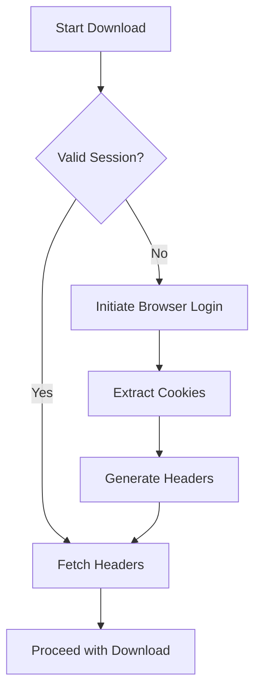

# MUBI Downloader Authentication Architecture

## Objective
Automate retrieval and management of authentication credentials through cookie extraction and header generation, thereby simplifying the downloading of MUBI films.

## Components

### 1. Auth Manager (auth_manager.py)
- **Cookie Extractor**
  - Uses browser_cookie3 to retrieve session cookies from the user's browser.
  - Filters cookies for the `mubi.com` domain.
  - Validates that required cookies (e.g., \`_mubi_session\`, \`remember_token\`) exist.

- **Token Manager**
  - Extracts the Bearer token from the session cookie.
  - Handles token refresh and expiration validation.

- **Header Generator**
  - Constructs the `authorization` header using the fresh Bearer token.
  - Constructs the `dt-custom-data` header based on session information.
  - Ensures proper encoding and formatting of headers.

- **Session Monitor**
  - Periodically validates session status.
  - Triggers re-authentication when needed.
  - Maintains a session heartbeat to ensure continuous access.

### 2. Authentication Flow



### 3. Security Considerations
- Credentials are not stored persistently on disk.
- Session cookies are held only in memory.
- All API calls use HTTPS.
- Tokens are rotated regularly to minimize risks.

## Implementation Plan

1. **Auth Module Development**
    - Create an `auth_manager.py` module implementing the above components.
    - Incorporate robust error handling for cookie extraction failures.
    - Implement a session monitoring mechanism to trigger re-authentication as needed.

2. **Integration with mubi_downloader.py**
    - Remove hardcoded authentication values from `mubi_downloader.py`.
    - Import and instantiate the `AuthManager` to dynamically generate headers.
    - Replace fixed header definitions with headers obtained from `AuthManager.generate_headers()`.

3. **Dependencies**
    - Use `browser_cookie3` (already present in requirements.txt), `requests`, and `json`.
    - Consider additional libraries (e.g., `cryptography`) if further token security enhancements are desired.

4. **Fallback and Manual Override**
    - Provide an option for manual credential override if cookie extraction fails.
    - Implement a browser automation fallback to initiate login when necessary.

## Auth Manager Code Blueprint

```python
# auth_manager.py
import browser_cookie3
import requests
import json
import base64
from typing import Dict

class AuthManager:
    def __init__(self):
        self.session_cookies = None
        self.bearer_token = None
        self.dt_custom_data = None
        
    def extract_cookies(self):
        \"\"\"Retrieve MUBI session cookies from the browser\"\"\"
        cookies = browser_cookie3.load(domain_name='mubi.com')
        self.session_cookies = {
            c.name: c.value for c in cookies
            if c.domain.endswith('mubi.com') and c.name in ['_mubi_session', 'remember_token']
        }
        if not self.session_cookies:
            raise ValueError("No valid MUBI session cookies found - please log in via your browser.")
    
    def generate_headers(self) -> Dict[str, str]:
        \"\"\"Generate the authentication headers required for API calls\"\"\"
        if not self.session_cookies:
            self.extract_cookies()
            
        # Decode the _mubi_session cookie; assumes it contains a JSON object with token info.
        session_data = json.loads(base64.b64decode(self.session_cookies['_mubi_session']))
        self.bearer_token = f"Bearer {session_data['token']}"
        
        # Construct custom header data
        custom_data = {
            'userId': session_data['user_id'],
            'sessionId': session_data['id'],
            'merchant': 'mubi'
        }
        self.dt_custom_data = base64.b64encode(json.dumps(custom_data).encode()).decode()
        
        return {
            'authorization': self.bearer_token,
            'dt-custom-data': self.dt_custom_data
        }
    
    def validate_session(self):
        \"\"\"Check if the current session is still valid\"\"\"
        test_url = 'https://api.mubi.com/v3/auth/status'
        headers = self.generate_headers()
        response = requests.get(test_url, headers=headers)
        return response.status_code == 200
```

## Conclusion
This architecture document outlines the strategy and implementation plan to automate MUBI film downloading by dynamically managing authentication. The approach leverages browser cookie extraction to generate secure headers, thereby eliminating hardcoded credentials and enhancing both security and usability.
